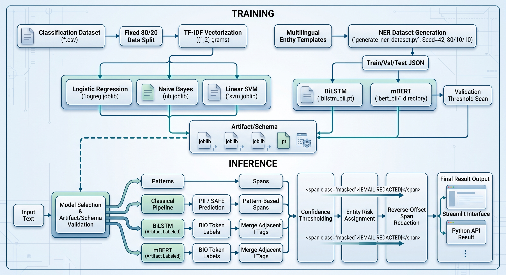
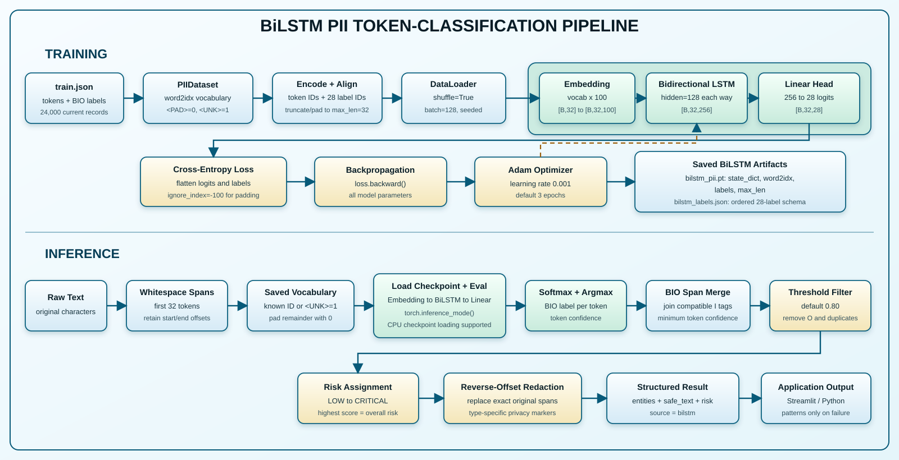
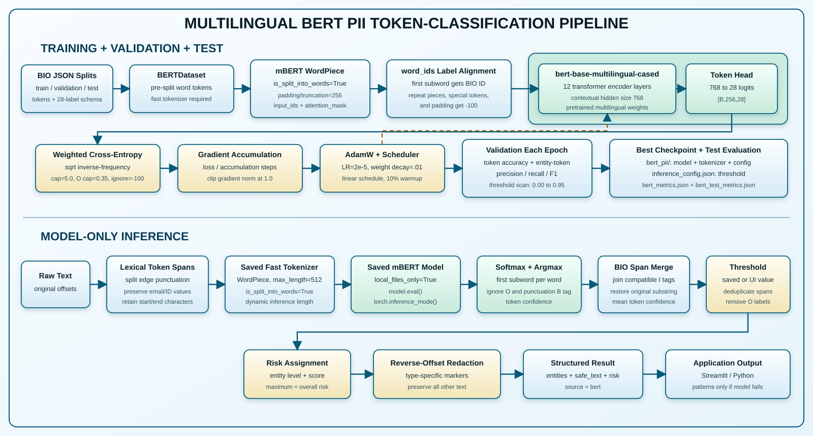

# PrivacyGuard — Multilingual PII Detection and Redaction

PrivacyGuard is a multilingual NLP project for detecting and redacting personally identifiable information (PII) in English, Bengali, and Banglish/code-mixed text.

It includes:

- a rule and context detector;
- scikit-learn and from-scratch Logistic Regression, Multinomial Naive Bayes, and Linear SVM document classifiers;
- BiLSTM and multilingual BERT token classifiers;
- span-safe redaction and privacy-risk scoring;
- a Streamlit model-comparison interface;
- a FastAPI pattern-scanning endpoint;
- reproducible synthetic BIO data generation for the neural models.

> Important: the included datasets are synthetic and template-generated. Saved scores show performance on this synthetic distribution, not production performance on unseen real-world text.

## Contents

1. [Project status](#project-status)
2. [What the system does](#what-the-system-does)
3. [Tasks and model choices](#tasks-and-model-choices)
4. [Complete system architecture](#complete-system-architecture)
5. [Supported entities and BIO labels](#supported-entities-and-bio-labels)
6. [Project structure](#project-structure)
7. [Installation](#installation)
8. [Quick start](#quick-start)
9. [Dataset pipelines](#dataset-pipelines)
10. [Preprocessing and text representation](#preprocessing-and-text-representation)
11. [Every model pipeline from start to finish](#every-model-pipeline-from-start-to-finish)
12. [Inference, confidence, risk, and redaction](#inference-confidence-risk-and-redaction)
13. [Training commands](#training-commands)
14. [Evaluation and current results](#evaluation-and-current-results)
15. [Streamlit application](#streamlit-application)
16. [FastAPI service](#fastapi-service)
17. [Testing](#testing)
18. [Limitations and recommended improvements](#limitations-and-recommended-improvements)
19. [Troubleshooting](#troubleshooting)

## Project status

| Capability | Status | Main implementation |
|---|---|---|
| Pattern/context PII detection | Implemented | `src/redection/` |
| Document-level PII classification | Implemented | scikit-learn Logistic Regression, Naive Bayes and SVM |
| Classical algorithms from scratch | Implemented | manual Logistic Regression, Multinomial Naive Bayes and Linear SVM |
| Neural token classification | Implemented | BiLSTM and multilingual BERT |
| Long-text BiLSTM inference | Implemented | overlapping 128-token windows with 32-token overlap |
| Exact-offset redaction and risk scoring | Implemented | reverse-offset span replacement |
| Interactive UI and API | Implemented | modern Streamlit dashboard and FastAPI pattern endpoint |
| RAG | Not implemented | no retriever, vector database or document-generation chain |
| Generative rewriting/pseudonymization | Future work | current system detects, classifies and redacts text |

## What the system does

Input:

```text
My name is Rahim Ahmed. Email me at rahim@example.com or call 01712345678.
```

Structured entity output contains the entity text, type, exact character offsets, confidence, source, and risk:

```json
{
  "entity": "rahim@example.com",
  "type": "EMAIL",
  "start": 36,
  "end": 53,
  "confidence": 0.99,
  "source": "pattern",
  "risk": "HIGH",
  "score": 3
}
```

Protected output:

```text
My name is [PERSON]. Email me at [EMAIL] or call [PHONE_NUMBER].
```

The application processes text locally and does not send it to an external generative API.

## Tasks and model choices

PrivacyGuard implements two different NLP tasks.

| Task | Models | Output | Exact PII spans? |
|---|---|---|---|
| Entity detection / NER | Pattern detector, BiLSTM, BERT | Entity type, offsets, confidence | Yes |
| Document classification | Logistic Regression, Naive Bayes, SVM, and their Scratch variants | Entire text is `PII` or `SAFE` | No |

The Streamlit application offers nine choices:

1. **Pattern detector** - finds structured patterns and selected contextual names/locations.
2. **BERT** - model-only multilingual token classification.
3. **BiLSTM** - model-only token classification with a learned word vocabulary.
4. **Logistic Regression** - classifies the full input; patterns provide redaction spans.
5. **Logistic Regression (Scratch)** - uses the manual NumPy classifier and its separate TF-IDF artifact.
6. **Naive Bayes** - classifies the full input; patterns provide redaction spans.
7. **Naive Bayes (Scratch)** - uses manual priors, Laplace smoothing, and log likelihoods.
8. **SVM** - classifies the full input; patterns provide redaction spans.
9. **SVM (Scratch)** - uses manual hinge loss, subgradients, and L2-regularized updates.

If a learned model is unavailable, incompatible, or fails, optional safe fallback uses the pattern detector.

## Complete system architecture



At training time, document classifiers learn from TF-IDF features while BiLSTM and mBERT learn BIO token labels. At inference time, the selected model returns either document classification or entity spans; confidence filtering, risk assignment and reverse-offset redaction then produce the protected output. The registry validates saved artifacts and can safely fall back to the pattern detector when a learned model fails.

## Supported entities and BIO labels

The shared neural schema is defined in `src/models/transformer/labels.py`.

| Entity | Example | Risk |
|---|---|---|
| `PERSON` | Rahim Ahmed | MEDIUM |
| `LOCATION` | Dhaka | LOW |
| `ORGANIZATION` | BRAC Bank | MEDIUM |
| `ADDRESS` | House 25 Road 7 Dhanmondi | HIGH |
| `PHONE` | 01712345678 | HIGH |
| `EMAIL` | user@example.com | HIGH |
| `NID` | 1234567890 | CRITICAL |
| `CREDIT_CARD` | 4532 0151 1283 0366 | CRITICAL |
| `ACCOUNT` | AC0123456789 | CRITICAL |
| `EMPLOYEE_ID` | EMP-45892 | HIGH |
| `MEDICAL_ID` | MED-32145 | CRITICAL |
| `STUDENT_ID` | CSE-2024-1025 | HIGH |
| `IP_ADDRESS` | 192.168.10.5 | HIGH |
| `DATE` | 21 February 2001 | MEDIUM |
| `PASSPORT` | A1234567 | CRITICAL |
| `HEALTH_CONDITION` | high blood pressure | CRITICAL |
| `OCCUPATION` | software engineer | MEDIUM |
| `EDUCATION` | Computer Science | MEDIUM |

### BIO representation

- `B-TYPE`: first token of an entity.
- `I-TYPE`: continuation token of a multi-token entity.
- `O`: token outside an entity.
- `-100`: training-only ignore value for padding and repeated BERT subword pieces.

| Token | Label |
|---|---|
| Rahim | `B-PERSON` |
| Ahmed | `I-PERSON` |
| lives | `O` |
| in | `O` |
| New | `B-LOCATION` |
| York | `I-LOCATION` |

Nine types support `I-` labels: `PERSON`, `LOCATION`, `ORGANIZATION`, `ADDRESS`, `CREDIT_CARD`, `DATE`, `HEALTH_CONDITION`, `OCCUPATION`, and `EDUCATION`.

The complete schema has 28 labels:

```text
1 O label + 18 B labels + 9 I labels = 28 labels
```

The pattern detector directly recognizes structured `EMAIL`, `PHONE`, `NID`, valid `CREDIT_CARD`, and `IP_ADDRESS` values, plus selected contextual `PERSON` and `LOCATION` spans. The neural dataset and redactor support all 18 types.

## Project structure

```text
PrivacyGuard_02/
|-- app.py                         # Streamlit entry point
|-- api.py                         # FastAPI pattern-scanning service
|-- train_all.py                   # Main training orchestrator
|-- requirements.txt
|-- data/
|   |-- raw/pii_dataset.csv
|   +-- processed/
|       |-- classification_dataset.csv
|       |-- ner_dataset.json
|       |-- train.json
|       |-- validation.json
|       +-- test.json
|-- models_saved/
|   |-- logistic_regression.joblib
|   |-- logistic_regression_scratch.joblib
|   |-- naive_bayes.joblib
|   |-- naive_bayes_scratch.joblib
|   |-- svm.joblib
|   |-- svm_scratch.joblib
|   |-- bilstm_pii.pt
|   |-- bilstm_labels.json
|   |-- bilstm_inference_config.json
|   +-- bert_pii/
|       |-- config.json
|       |-- model.safetensors
|       |-- tokenizer.json
|       +-- inference_config.json
|-- results/
|   |-- baseline_results.csv
|   |-- bilstm_metrics.json
|   |-- bert_metrics.json
|   |-- bert_test_metrics.json
|   |-- logistic_regression_scratch_results.json
|   |-- naive_bayes_scratch_results.json
|   +-- svm_scratch_results.json
|-- src/
|   |-- app/app.py
|   |-- dataset/
|   |-- evaluation/evaluate_bert.py
|   |-- features/
|   |-- inference/model_service.py
|   |-- models/baseline/            # Three manual classical implementations
|   |-- models/lstm/
|   |-- models/transformer/
|   |-- preprocessing/
|   +-- redection/                  # Existing package name
|-- tests/                           # Registry, redaction and model unit tests
+-- notebooks/01_EDA.ipynb
```

## Installation

### Requirements

- Python 3.10 or 3.11 is recommended.
- At least 8 GB RAM is recommended.
- A CUDA-capable NVIDIA GPU is optional but strongly recommended for BERT.
- Internet is required the first time the mBERT base model/tokenizer is downloaded.

### Windows PowerShell

```powershell
cd C:\nlp\PrivacyGuard_02
py -3.11 -m venv venv
.\venv\Scripts\Activate.ps1
python -m pip install --upgrade pip
pip install -r requirements.txt
```

If PowerShell blocks activation:

```powershell
Set-ExecutionPolicy -Scope Process -ExecutionPolicy Bypass
.\venv\Scripts\Activate.ps1
```

### Linux or macOS

```bash
cd PrivacyGuard_02
python3 -m venv venv
source venv/bin/activate
python -m pip install --upgrade pip
pip install -r requirements.txt
```

### Optional CUDA-enabled PyTorch

The normal requirements installation may install CPU-only PyTorch. Use the official PyTorch installation selector for the CUDA wheel compatible with the operating system and driver:

<https://pytorch.org/get-started/locally/>

Verify the active environment:

```powershell
python -c "import torch; print('version:', torch.__version__); print('CUDA build:', torch.version.cuda); print('CUDA available:', torch.cuda.is_available()); print('device:', torch.cuda.get_device_name(0) if torch.cuda.is_available() else 'CPU')"
```

Having an NVIDIA GPU does not guarantee that the current Python environment uses it. `torch.cuda.is_available()` must return `True`.

## Quick start

Run the saved models in Streamlit:

```powershell
cd C:\nlp\PrivacyGuard_02
.\venv\Scripts\Activate.ps1
python -m streamlit run app.py
```

Run the tests:

```powershell
python -m pytest
```

Inspect model readiness:

```powershell
python -c "from pprint import pprint; from src.inference.model_service import available_models; pprint(available_models())"
```

Use Python inference:

```python
from src.inference.model_service import analyze

result = analyze(
    "My name is Rahim Ahmed. Call me at 01712345678.",
    model_name="BERT",
    threshold=0.80,
    fallback=True,
)

print(result["entities"])
print(result["safe_text"])
```

## Dataset pipelines

### Document-classification data

The classical models use `data/processed/classification_dataset.csv`.

| Column | Meaning |
|---|---|
| `id` | Record identifier |
| `text` | Complete input sentence |
| `label` | `1` for PII and `0` for safe text |

The current file has 6,000 records: 3,730 PII and 2,270 safe. During training, `train_all.py` performs a stratified 80/20 split with `random_state=42`. TF-IDF is fitted only on training data because it is inside each scikit-learn pipeline.

`src/dataset/create_dataset.py` and `create_labels.py` are legacy builders. They generate simple templates and weak labels based mainly on phone, email, and 10-digit patterns. They are not called automatically by `train_all.py`.

### Neural NER data

Generate 30,000 multilingual records:

```powershell
python -m src.dataset.generate_ner_dataset --samples 30000 --seed 42
```

The generator:

1. creates entity values and English, Bengali, Banglish, long-form, and negative templates;
2. assigns BIO labels directly while inserting entities;
3. shuffles with a local seeded generator;
4. writes the full dataset;
5. creates an 80/10/10 train, validation, and test split.

| File | Current records | Purpose |
|---|---:|---|
| `ner_dataset.json` | 30,000 | Complete dataset |
| `train.json` | 24,000 | BiLSTM and BERT fitting |
| `validation.json` | 3,000 | BiLSTM/BERT checkpoint and threshold selection |
| `test.json` | 3,000 | Held-out neural-model evaluation |

Record format:

```json
{
  "tokens": ["Rahim", "Ahmed", "lives", "in", "Dhaka", "."],
  "labels": ["B-PERSON", "I-PERSON", "O", "O", "B-LOCATION", "O"]
}
```

### Reproducibility

- Neural generation is reproducible with the same `--samples` and `--seed`.
- Neural training seeds Python/PyTorch, though exact GPU output can still vary.
- Classical splitting uses random state 42.
- The legacy classification generator does not set a random seed.

`--ner-samples` is the total before splitting:

```text
--ner-samples 1500 -> 1200 train + 150 validation + 150 test
```

`--bert-samples 0` means the complete training split. A positive value limits BERT training records.

## Preprocessing and text representation

The project does not apply one identical pipeline to all models. Each architecture needs different input preservation.

### Runtime span tokenization

`_lexical_spans()` in `src/inference/model_service.py`:

- finds non-whitespace tokens;
- separates edge punctuation;
- preserves exact character offsets;
- keeps emails, phones, `EMP-45892`, and `CSE-2024-1025` together.

Offsets matter because redaction slices the original text.

### Classical TF-IDF processing

The active scikit-learn vectorizer:

- lowercases by default;
- uses its default word token pattern;
- uses no explicit stop-word list;
- uses no stemming;
- uses no lemmatization;
- extracts word unigrams and bigrams;
- keeps at most 10,000 features.

For `"my phone number"`:

```text
unigrams: "my", "phone", "number"
bigrams:  "my phone", "phone number"
```

TF-IDF emphasizes terms frequent in one document but less common across the collection.

### Is this an n-gram language model?

No. `ngram_range=(1, 2)` creates classifier features. It does not predict the next word or generate text.

`src/features/ngram_features.py` contains experimental word 1-to-3-gram and character 3-to-5-gram count utilities. They are not connected to `train_all.py`.

### Legacy preprocessing

`src/preprocessing/` contains:

```text
NFKC Unicode normalization
  -> repeated-character reduction
  -> HTML/URL/special-character cleaning
  -> lowercase
  -> NLTK tokenization
  -> informal spelling/noise mapping
```

However:

- `remove_stopwords()` exists but is not called;
- stemming is not implemented;
- lemmatization is not implemented;
- this pipeline is not used by active model training;
- its ASCII-only cleaner removes Bengali letters, so it should not be added to multilingual NER unchanged.

## Every model pipeline from start to finish

### 1. Pattern and context detector

Code: `src/redection/entity_detector.py`

```text
raw text
  -> structured regex candidates
       email, Bangladesh phone, NID, IP, card candidate
  -> Luhn validation for cards
  -> contextual PERSON candidates
  -> contextual/gazetteer LOCATION candidates
  -> overlap resolution
       pattern > context > gazetteer > whole-name phrase
  -> ordered exact spans
  -> fixed confidence and risk
  -> thresholded redaction
```

Properties:

- no training required;
- manually assigned confidence values;
- Bengali digits supported for numeric validation;
- high speed and exact offsets;
- direct coverage is narrower than the neural schema.

Real scenario: a help-desk system can use it as a fast safety layer before tickets are stored or forwarded.

### 2. Shared classical pipeline

```text
classification_dataset.csv
  -> remove missing text/label
  -> stratified 80/20 split, seed 42
  -> TF-IDF: word (1,2)-grams, maximum 10,000 features
  -> classifier fit
  -> document PII/SAFE prediction
  -> weighted metrics
  -> joblib artifact
```

Application inference:

```text
input -> saved TF-IDF + classifier -> PII/SAFE
      -> pattern detector for spans -> protected text
```

The classifier cannot locate which characters caused its prediction.

#### Logistic Regression

```text
TF-IDF x -> linear score w.x + b -> binary decision -> PII/SAFE
```

Configuration: `max_iter=1000` and `class_weight="balanced"`.

Artifact: `models_saved/logistic_regression.joblib`

#### Multinomial Naive Bayes

```text
TF-IDF -> class priors and feature likelihoods
       -> compare class scores -> PII/SAFE
```

This is a fast baseline, but its feature-independence assumption is simplified.

Artifact: `models_saved/naive_bayes.joblib`

#### Linear SVM

```text
TF-IDF -> maximum-margin linear boundary -> signed score -> PII/SAFE
```

Configuration: `class_weight="balanced"`. The current SVM does not expose calibrated probabilities.

Artifact: `models_saved/svm.joblib`

#### What “from scratch” means

The three scratch variants keep the same TF-IDF representation so their results remain comparable, but their classifier mathematics is implemented in this repository instead of calling the equivalent scikit-learn estimator:

| Scratch model | Manually implemented operations |
|---|---|
| Logistic Regression | `w·x + b`, sigmoid, binary cross-entropy, analytical gradients and gradient descent |
| Multinomial Naive Bayes | class priors, feature counts, Laplace smoothing and joint log likelihood |
| Linear SVM | hinge loss, L2 regularization, subgradients and iterative parameter updates |

Their source files and trainers are under `src/models/baseline/`. TF-IDF itself still comes from scikit-learn; only the classifiers are hand-written.

### 3. BiLSTM sequence labeler

Code: `src/models/lstm/`



Training:

```text
train.json
  -> Unicode/case/digit normalization and reusable email shape token
  -> minimum-frequency vocabulary: <PAD>=0, <UNK>=1
  -> token IDs, pad/truncate training windows to 128
  -> word dropout trains a useful <UNK> representation
  -> embedding: vocabulary_size x 100
  -> packed sequences ignore trailing padding
  -> bidirectional LSTM: hidden 128 per direction
  -> concatenate directions: 256 values/token
  -> dropout
  -> linear layer: 256 -> 28 label logits
  -> class-weighted cross-entropy, ignore padding label -100
  -> AdamW + gradient clipping
  -> validation threshold scan and entity-token metrics
  -> early stopping and best-checkpoint saving
```

Output shape:

```text
[batch_size, 128, 28]
```

Inference:

```text
text -> exact lexical spans across the complete document
     -> overlapping 128-token windows with 32-token overlap
     -> normalized saved-vocabulary IDs
     -> packed BiLSTM -> softmax BIO labels
     -> keep the prediction with the strongest boundary context
     -> merge compatible I tags
     -> validation-selected confidence threshold -> risk -> redaction
```

Padding uses `-100` rather than `O`, and `CrossEntropyLoss(ignore_index=-100)` prevents empty positions from being learned as outside tokens.

The checkpoint stores its vocabulary because rebuilding it can assign different IDs and cause incorrect output or size errors.

Artifacts:

- `models_saved/bilstm_pii.pt`
- `models_saved/bilstm_labels.json`
- `models_saved/bilstm_inference_config.json`
- `results/bilstm_metrics.json`

Strengths: bidirectional context, full-document sliding-window inference, a relatively small model, and educationally clear training code.

Limitations: unseen names and misspellings can still map to `<UNK>`, and synthetic template data can produce confident errors on substantially different real-world writing.

### 4. Multilingual BERT token classifier

Base model: `google-bert/bert-base-multilingual-cased`

Code: `src/models/transformer/` and `src/evaluation/evaluate_bert.py`



Training:

```text
train.json
  -> fast mBERT tokenizer with pre-split words
  -> WordPiece subwords and word_ids alignment
       first subword gets the word label
       other subwords/special/padding get -100
  -> pad/truncate to 256 subwords
  -> multilingual BERT encoder
  -> token head: hidden state -> 28 logits
  -> weighted cross-entropy
       sqrt inverse-frequency weights
       maximum weight 5.0, O maximum 0.35
  -> AdamW, default LR 2e-5, weight decay 0.01
  -> linear schedule with 10% warmup
  -> gradient clipping at 1.0
  -> validation after each epoch
  -> save best validation entity-token F1 checkpoint
```

Gradient accumulation gives:

```text
effective batch = batch size x accumulation steps
```

Validation scans thresholds from 0.0 to 0.95 and stores the best in `models_saved/bert_pii/inference_config.json`.

Inference:

```text
text -> offset-preserving lexical tokens
     -> saved tokenizer, maximum 512 subwords
     -> BERT logits and softmax
     -> first subword prediction per lexical token
     -> merge compatible I tags
     -> mean confidence across merged tokens
     -> threshold -> risk -> redaction
```

Strengths: multilingual pretrained context and better handling of unseen words through subwords.

Limitations: high CPU training cost, large artifact, and dependence on synthetic training diversity.

### 5. Optional Word2Vec utility

`src/features/embeddings.py` defines a 100-dimensional skip-gram Word2Vec model and mean sentence embeddings. It is experimental and not used by `train_all.py`, Streamlit, or the nine-model registry.

## Inference, confidence, risk, and redaction

### Registry and compatibility checks

`available_models()` checks artifacts. For BERT and BiLSTM it verifies that saved label order matches the shared 28-label schema, preventing old checkpoints from loading into new output layers.

### Confidence

Confidence values are not directly comparable:

- pattern confidence is manually assigned;
- BERT/BiLSTM confidence is maximum token softmax;
- merged BERT confidence is the mean token confidence;
- merged BiLSTM confidence is the minimum token confidence;
- SVM has no calibrated entity probability;
- classical redaction uses pattern entities and confidence.

Low neural confidence can come from limited training, imbalance, unfamiliar tokens, ambiguous context, or an incompatible checkpoint. Lowering the threshold improves recall but can increase false positives. Softmax is not guaranteed real-world correctness.

### Risk

| Score | Level | Examples |
|---:|---|---|
| 1 | LOW | Location |
| 2 | MEDIUM | Person, date, organization, occupation, education |
| 3 | HIGH | Phone, email, IP, address, employee/student ID |
| 4 | CRITICAL | NID, card, account, passport, medical ID, health condition |

Overall document risk is the highest entity score, not a sum.

### Span-safe redaction

The redactor:

1. keeps entities meeting the threshold;
2. sorts spans from end to start;
3. replaces exact `text[start:end]` slices with markers.

Reverse order prevents one replacement from invalidating later offsets.

| Type | Marker |
|---|---|
| `PERSON` | `[PERSON]` |
| `PHONE` | `[PHONE_NUMBER]` |
| `EMAIL` | `[EMAIL]` |
| `ACCOUNT` | `[ACCOUNT_NUMBER]` |
| Unknown | `[PRIVATE_DATA]` |

### Failure fallback

`analyze(..., fallback=True)` catches model loading/inference errors and uses patterns. The result reports the requested and actual model. Use `fallback=False` to expose the original error while debugging.

## Training commands

Run commands from the project root with the virtual environment active.

### Options

```powershell
python train_all.py --help
```

### Classical models

```powershell
python train_all.py
```

Creates three `.joblib` files and `results/baseline_results.csv`.

### Optional classical models from scratch

The project contains separate NumPy implementations of Logistic Regression,
Multinomial Naive Bayes, and linear SVM. They reuse sparse TF-IDF features,
produce separate artifacts, and do not replace the scikit-learn models.

```powershell
python -m src.models.baseline.train_logistic_scratch
python -m src.models.baseline.train_naive_bayes_scratch
python -m src.models.baseline.train_svm_scratch
```

Separate outputs:

- `models_saved/logistic_regression_scratch.joblib`
- `models_saved/naive_bayes_scratch.joblib`
- `models_saved/svm_scratch.joblib`
- `results/logistic_regression_scratch_results.json`
- `results/naive_bayes_scratch_results.json`
- `results/svm_scratch_results.json`

### Generate NER data only

```powershell
python -m src.dataset.generate_ner_dataset --samples 30000 --seed 42
```

Minimum sample count is 100.

### BiLSTM with new data

```powershell
python train_all.py --skip-classical --bilstm --ner-samples 30000
```

`train_all.py` uses BiLSTM defaults: up to 8 epochs, batch 128, maximum training window 128, seed 42, validation, and early stopping.

Custom BiLSTM training with existing data:

```powershell
python -m src.models.lstm.train --epochs 8 --batch-size 128 --max-length 128 --seed 42
```

### Small BERT experiment

```powershell
python train_all.py --skip-classical --bert --ner-samples 1500 --bert-samples 0 --bert-epochs 3 --bert-batch-size 8
```

This generates 1,500 total records, trains on 1,200, validates on 150, and tests on 150.

### BERT on the existing full splits

```powershell
python train_all.py --skip-classical --bert --skip-ner-generation --bert-samples 0 --bert-epochs 3 --bert-batch-size 8
```

With the current data this trains on all 24,000 training records.

### Lower GPU-memory usage

```powershell
python train_all.py --skip-classical --bert --skip-ner-generation --bert-samples 0 --bert-epochs 3 --bert-batch-size 4 --bert-gradient-accumulation 2
```

Batch 4 and accumulation 2 give an effective batch near 8.

### Everything in one run

```powershell
python train_all.py --bilstm --bert --ner-samples 30000 --bert-samples 0 --bert-epochs 3 --bert-batch-size 8
```

### Direct BERT options and evaluation

```powershell
python -m src.models.transformer.train --help
python -m src.evaluation.evaluate_bert --batch-size 8
```

The direct trainer also exposes learning rate, model name, and seed. BERT may take hours on CPU; verify CUDA before a long run.

## Evaluation and current results

### Classical

The classical pipeline reports accuracy and weighted precision, recall, and F1.

| Model | Accuracy | Precision | Recall | F1 |
|---|---:|---:|---:|---:|
| Logistic Regression | 1.0000 | 1.0000 | 1.0000 | 1.0000 |
| Logistic Regression (Scratch) | 1.0000 | 1.0000 | 1.0000 | 1.0000 |
| Naive Bayes | 1.0000 | 1.0000 | 1.0000 | 1.0000 |
| Naive Bayes (Scratch) | 1.0000 | 1.0000 | 1.0000 | 1.0000 |
| SVM | 1.0000 | 1.0000 | 1.0000 | 1.0000 |
| SVM (Scratch) | 1.0000 | 1.0000 | 1.0000 | 1.0000 |

### BiLSTM

The improved BiLSTM was trained on 24,000 records, validated on 3,000 records and saved at the best validation checkpoint. It uses a 128-token training window and automatically applies overlapping windows to longer input.

| Validation metric | Value |
|---|---:|
| Token accuracy | 1.0000 |
| Entity-token precision | 1.0000 |
| Entity-token recall | 1.0000 |
| Entity-token F1 | 1.0000 |
| Recommended threshold | 0.50 |
| Best epoch | 5 |

A separate 3,000-record synthetic test check also produced 1.0000 token accuracy, precision, recall and F1 at threshold 0.50. A 152-token manual inference check detected an email after token 150 with confidence 0.9948, confirming that inference no longer stops at a fixed first window.

### BERT

BERT reports accuracy and micro precision/recall/F1 over non-`O` token labels.

| Held-out test metric | Value |
|---|---:|
| Token accuracy | 0.999932 |
| Entity-token precision | 0.999891 |
| Entity-token recall | 0.999837 |
| Entity-token F1 | 0.999864 |
| Recommended threshold | 0.0 |

These near-perfect results require caution. The generator uses a finite template/value system and performs a random record split after generation, so related patterns can cross splits. Metrics are token-level, not strict whole-span metrics.

The results demonstrate learning of the generated distribution; they do not prove equal accuracy on real emails, medical text, spelling variants, adversarial formats, or unseen organizations.

A defensible evaluation should add:

- a human-reviewed gold test set;
- template/source-group splitting before augmentation;
- strict span-level and per-entity metrics;
- confusion matrices and error analysis;
- evaluation on an independent public PII dataset.

## Streamlit application

Run:

```powershell
python -m streamlit run app.py
```

Features:

- responsive dark privacy-dashboard design;
- nine model choices and artifact status;
- model-specific confidence threshold and safe-fallback controls;
- English, Bengali, and Banglish examples;
- risk-colored result badges and summary metrics;
- confidence progress bars and exact offsets;
- protected-text download;
- local-processing privacy notice.

Successful BERT/BiLSTM runs use model-only NER; patterns are not silently added. Classical runs use document prediction plus pattern spans.

## FastAPI service

Run:

```powershell
python api.py
```

or:

```powershell
python -m uvicorn api:app --host 127.0.0.1 --port 8000 --reload
```

Documentation: <http://127.0.0.1:8000/docs>

Health:

```powershell
Invoke-RestMethod http://127.0.0.1:8000/health
```

Scan:

```powershell
$body = @{
    text = "Call 01712345678 or email user@example.com"
    confidence_threshold = 0.80
} | ConvertTo-Json

Invoke-RestMethod -Uri http://127.0.0.1:8000/scan -Method Post -ContentType "application/json" -Body $body
```

The current `/scan` calls `privacy_guard()`, so it uses pattern/context detection only. It has no BERT/BiLSTM/classical selection parameter.

Limits:

- text: 1 to 100,000 characters;
- confidence threshold: 0.0 to 1.0.

## Testing

```powershell
python -m pytest
```

The current suite contains 27 tests. It covers multi-entity redaction, Bengali preservation, card validation, fallback, all nine registry entries, scratch-classifier mathematics, long-text BiLSTM windowing, padding-independent packed sequences, token normalization, BIO coverage, model-only BERT behavior, and sensitive-token preservation.

Manual checks:

```powershell
python -c "from src.redection.privacy_firewall import privacy_guard; print(privacy_guard('My name is Rahim Ahmed and my phone is 01712345678'))"
python -c "from src.inference.model_service import analyze; print(analyze('Email user@example.com', 'BERT', fallback=False))"
```

## Limitations and recommended improvements

### Current limitations

1. Neural data is synthetic and uses a limited template bank.
2. Records are split after generation, not by template family.
3. BIO JSON does not store original-text character offsets.
4. BIOES is not implemented; the project uses BIO.
5. The test set is not a manually reviewed gold set.
6. Pattern coverage is narrower than the neural schema.
7. BiLSTM still represents genuinely unseen rare words with one shared `<UNK>` vector.
8. BiLSTM validation is token-level and based on synthetic data rather than a human-reviewed gold set.
9. BERT evaluation is token-level, not strict span-level.
10. Classical labels are simple weak labels and can reward template memorization.
11. FastAPI exposes patterns only.
12. Controlled pseudonymization and generative safe rewriting are not implemented.

### Highest-value improvements

1. Assign templates group IDs and split groups before augmentation.
2. Add hundreds of structurally different templates and difficult safe hard negatives.
3. Create and double-review a smaller gold test set.
4. Store original text, token offsets, entity spans, and annotator metadata.
5. Add strict span-level/per-type evaluation with `seqeval` or `nervaluate`.
6. Add character/subword embeddings or a CRF to further improve BiLSTM robustness and BIO consistency.
7. Add patterns for passport, account, date of birth, username, and address.
8. Add deterministic, format-preserving pseudonymization.
9. Add separately evaluated safe rewriting with a mandatory post-generation PII scan.
10. Add API model selection and audit metadata without logging raw PII.

### Suggested pseudonymization architecture

```text
input
  -> strongest detector
  -> normalized non-overlapping spans
  -> per-document keyed replacement map
       PERSON -> synthetic name
       EMAIL -> example-domain address
       PHONE -> valid-format fake number
       ADDRESS -> synthetic address
  -> replace right to left
  -> post-transformation safety scan
  -> rewritten text + non-sensitive metadata
```

Use controlled replacement rather than unconstrained generation. If a language model later rewrites style, block output that fails the final PII scan.

## Troubleshooting

### `ModuleNotFoundError`

```powershell
.\venv\Scripts\Activate.ps1
pip install -r requirements.txt
```

Use `python -m ...` so imports use the active interpreter.

### Model is marked missing or outdated

The artifact is absent or its saved labels do not match the 28-label schema. Regenerate data and retrain. Never combine new label metadata with old weights.

### BiLSTM tensor-size RuntimeError

The checkpoint probably uses an old output layer or vocabulary. Retrain so `bilstm_pii.pt` and `bilstm_labels.json` are generated together:

```powershell
python train_all.py --skip-classical --bilstm --ner-samples 30000
```

### Low BERT confidence

Check the checkpoint, losses, label frequency, unseen formats, validation calibration, and dataset representativeness. Do not treat softmax as a guaranteed probability.

### CUDA is unavailable

```powershell
python -c "import torch; print(torch.__version__); print(torch.version.cuda); print(torch.cuda.is_available())"
```

If the version includes `+cpu` or `torch.version.cuda` is `None`, install a CUDA build in this virtual environment using the official selector.

### CUDA out of memory

```powershell
python train_all.py --skip-classical --bert --skip-ner-generation --bert-samples 0 --bert-batch-size 2 --bert-gradient-accumulation 4
```

### CPU training is slow

- start with 1,500 to 3,000 generated samples;
- use one epoch to validate the pipeline;
- reuse splits with `--skip-ner-generation`;
- move full BERT runs to a CUDA GPU or cloud notebook.

### Requested model falls back to patterns

Read the Streamlit warning or set `fallback=False` to reveal the error. Check `available_models()`, dependencies, artifact paths, and label compatibility.

## Responsible use

PrivacyGuard is an educational/research system. Do not claim regulatory compliance or deploy it as the only protection for sensitive production data without independent review, representative evaluation, access controls, encryption, safe logging, and a fail-closed policy.

Never add real secrets, passwords, payment credentials, or unapproved personal records to the repository.
